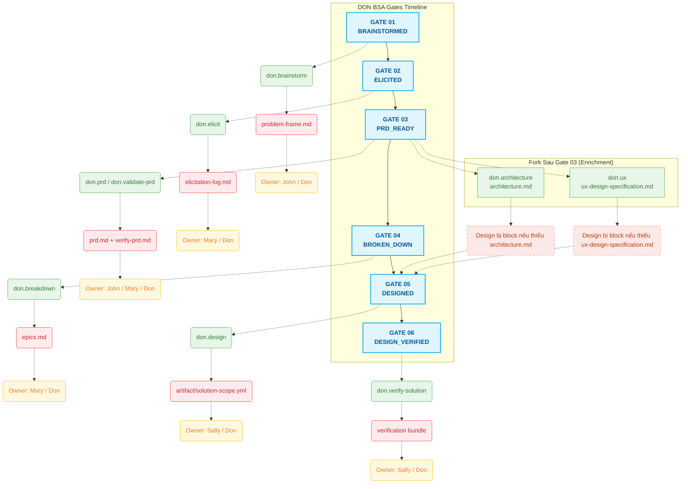

# AI Coworker

```mermaid
flowchart TD
    classDef gate fill:#e1f5fe,stroke:#03a9f4,stroke-width:2px,color:#01579b,font-weight:bold
    classDef cmd fill:#e8f5e9,stroke:#4caf50,stroke-width:1px,color:#2e7d32
    classDef proof fill:#ffebee,stroke:#f44336,stroke-width:1px,color:#c62828
    classDef owner fill:#fff8e1,stroke:#ffc107,stroke-width:1px,color:#f57f17
    classDef note fill:#fbe9e7,stroke:#ff8a65,stroke-width:1px,stroke-dasharray: 5 5,color:#bf360c

    subgraph "DON BSA Gates Timeline"
        G1["GATE 01<br>BRAINSTORMED"]:::gate
        G2["GATE 02<br>ELICITED"]:::gate
        G3["GATE 03<br>PRD_READY"]:::gate
        G4["GATE 04<br>BROKEN_DOWN"]:::gate
        G5["GATE 05<br>DESIGNED"]:::gate
        G6["GATE 06<br>DESIGN_VERIFIED"]:::gate

        G1 --> G2
        G2 --> G3
        G3 --> G4
        G4 --> G5
        G5 --> G6
    end

    %% G1 Details
    C1("don.brainstorm"):::cmd
    P1("problem-frame.md"):::proof
    O1("Owner: John / Don"):::owner
    G1 -.-> C1 -.-> P1 -.-> O1

    %% G2 Details
    C2("don.elicit"):::cmd
    P2("elicitation-log.md"):::proof
    O2("Owner: Mary / Don"):::owner
    G2 -.-> C2 -.-> P2 -.-> O2

    %% G3 Details
    C3("don.prd / don.validate-prd"):::cmd
    P3("prd.md + verify-prd.md"):::proof
    O3("Owner: John / Mary / Don"):::owner
    G3 -.-> C3 -.-> P3 -.-> O3

    %% FORK POST GATE 03
    subgraph "Fork Sau Gate 03 (Enrichment)"
        F_ARCH["don.architecture<br>architecture.md"]:::cmd
        F_UX["don.ux<br>ux-design-specification.md"]:::cmd
    end
    
    G3 -.-> F_ARCH
    G3 -.-> F_UX
    
    F_NOTE1("Design bị block nếu thiếu architecture.md"):::note
    F_NOTE2("Design bị block nếu thiếu ux-design-specification.md"):::note
    
    F_ARCH -.-> F_NOTE1 -.-> G5
    F_UX -.-> F_NOTE2 -.-> G5

    %% G4 Details
    C4("don.breakdown"):::cmd
    P4("epics.md"):::proof
    O4("Owner: Mary / Don"):::owner
    G4 -.-> C4 -.-> P4 -.-> O4

    %% G5 Details
    C5("don.design"):::cmd
    P5("artifact/solution-scope.yml"):::proof
    O5("Owner: Sally / Don"):::owner
    G5 -.-> C5 -.-> P5 -.-> O5

    %% G6 Details
    C6("don.verify-solution"):::cmd
    P6("verification bundle"):::proof
    O6("Owner: Sally / Don"):::owner
    G6 -.-> C6 -.-> P6 -.-> O6
```
