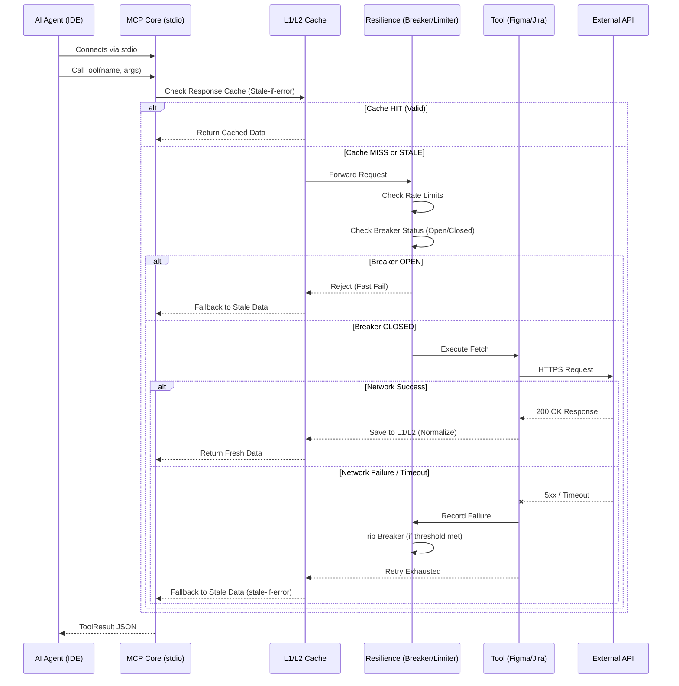

# Architecture Design: DON Workspace MCP Server

**Date:** 2026-03-23
**Repository:** [MCP-server](https://github.com/cachep-xidau/MCP-server.git)
**Target Audience:** Internal Developer Team (6-10 members), BSA, Tech Leads
**Primary Goal:** Establish a unified Local MCP hub providing integrations with Figma, Jira, Confluence, and high-speed Offline RAG querying.

---

## 1. System Overview

The **DON Workspace MCP Server** operates entirely on the "Local-First" methodology (Zero-Latency, YAGNI, KISS). Instead of establishing a vulnerable and latency-heavy remote server for AI Tool queries, the MCP Server is deployed locally on every team member's workspace (Laptop/PC) using the **`stdio` communication protocol**.

When an AI Agent (Gemini in Antigravity, local Codex CLI, etc.) requires context or external actions, it spawns this MCP Server locally.

## 2. Architecture Topology

The diagram below illustrates the complete execution environment, the background synchronization mechanism for the Knowledge Base, and the external API connections.

```mermaid
C4Context
    title DON Workspace MCP - Runtime Component Topology

    Person(agent, "AI Agent", "Gemini / Claude / Codex\n(Host IDE Process)")
    
    System_Boundary(mcp_process, "MCP Node.js Process (Spawned via stdio)") {
        Component(core_router, "Core Router", "Protocol Handler", "Parses JSON-RPC over stdio")
        
        Boundary(resilience_layer, "Resilience & State Layer") {
            Component(circuit_breaker, "Circuit Breaker", "Opossum", "Prevents cascading upstream failures")
            Component(rate_limiter, "Rate Limiter", "Token Bucket", "Controls API throughput")
            Component(cache_mgr, "Cache Manager", "L1 Mem + L2 SQLite", "stale-if-error & offline fallback")
        }
        
        Boundary(tools_layer, "Integration Hubs") {
            Component(t_search, "FTS5 Search", "RAG Tool", "Queries local DB")
            Component(t_figma, "Figma Gateway", "REST Wrapper", "Extracts design tokens")
            Component(t_jira, "Jira Gateway", "REST Wrapper", "Syncs Epics/Stories")
        }
    }

    SystemDb(local_db, "Local RAG DB", "SQLite WAL", "High-speed read replica")
    System_Ext(don_server, "DON Architecture Server", "Master Knowledge Base")
    System_Ext(external_apis, "External APIs", "Figma / Jira / Confluence")

    Rel(agent, core_router, "Spawns & Queries", "stdio / JSON-RPC")
    Rel(core_router, circuit_breaker, "Routes Request")
    Rel(circuit_breaker, rate_limiter, "Validates")
    Rel(rate_limiter, cache_mgr, "Checks Cache")
    
    Rel(cache_mgr, tools_layer, "Cache Miss (Fetch)")
    Rel(t_search, local_db, "Reads (0ms latency)", "SQL MATCH")
    Rel(tools_layer, external_apis, "HTTPS / REST")
    
    Rel(don_server, local_db, "Background CRON Sync", "SSH/HTTP")
```

### 2.1. Request Lifecycle Sequence

This sequence diagram illustrates how a tool execution request flows through the internal resilience and caching layers, demonstrating the aggressive offline fallback strategy.



---

## 3. Core Components Breakdown

### 3.1. Local AI Agent & Stdio Protocol
The AI Agent initiates the standard Model Context Protocol via standard input/output (`stdio`). 
- **Ram Usage:** Extremely lightweight. Booting the Node.js/Python MCP process temporarily consumes only ~50-120MB memory. Process dies gracefully when the AI session ends.
- **Latency:** Execution time is limited purely by local CPU processing power. Network latency for establishing a tool connection is exactly `0ms`.

### 3.2. RAG Tool (FTS5-BM25 SQLite)
The primary Search Tool used by the `DON MCP Server`.
- Performs **Query Expansion** and applies `trigram`/`porter` tokenizers alongside FTS5.
- Uses the `snippet()` function to retrieve small contextual paragraphs rather than whole documents.
- Retrieves text exclusively from the local `remote-rag.db` replica, ensuring massive queries will not spam the central server or incur delay.

### 3.3. Remote Data Sync (Background Daemon)
For 10 simultaneous projects with constant internal spec updates, forcing the MCP to pull standard queries across the network is anti-pattern.
- A small background job (Cron/Script) continuously pulls the authoritative `remote-rag.db` from the **DON Architecture Server** to the `~/Company` workspace.
- **SQLite Advantage:** Reading the DB file doesn't block background pulling/replacing if orchestrated via WAL mode (Write-Ahead Logging). 

### 3.4. Multi-Service Integrations
Aside from RAG queries, the server acts as an aggregation point (Facade Pattern) for specialized automation:
- **Jira MCP:** Create Epics, track story points, retrieve acceptance criteria.
- **Confluence MCP:** Provide dynamic scraping when the offline RAG database doesn't hold the latest 5-minute changes.
- **Figma MCP:** Fetch design token updates, verify screen layouts against Figma nodes.

---

## 4. Repository Structure & Usage
Mã nguồn đã được xây dựng chuẩn theo kiến trúc trên với các thành phần chính:
- `src/index.ts`: Hub Router chính điều phối Stdio Transport.
- `src/tools/search_kb.ts`: Truy vấn FTS5-BM25 SQLite.
- `src/tools/figma.ts`, `jira.ts`, `confluence.ts`: Các Hub bọc Native REST API tới Atlassian và Figma.
- `scripts/sync-db.sh`: Bash script đồng bộ Database nền tảng.

### Cài đặt (Installation)
1. Kéo repository về: `git clone https://github.com/cachep-xidau/MCP-server.git`
2. Cài đặt thư viện: `npm install`
3. Cấu hình `.env` dựa theo document (Cần JIRA_API_TOKEN, API_KEY_FIGMA, DB_PATH).
4. Build mã nguồn: `npm run build`

### Agent Configuration (Claude Code / Gemini / Cursor)
Thêm khối cấu hình sau vào máy Local (VD: `~/.claude/.mcp.json`):
```json
"don-workspace-rag": {
  "command": "node",
  "args": ["/đường/dẫn/tới/MCP-server/build/index.js"]
}
```

### Kích hoạt Đồng bộ DB (CronJob Sync)
Bật script tự động kéo `remote-rag.db` từ Server công ty mỗi 5 phút bằng System Cron:
```bash
chmod +x scripts/sync-db.sh
(crontab -l 2>/dev/null; echo "*/5 * * * * bash $(pwd)/scripts/sync-db.sh") | crontab -
```
