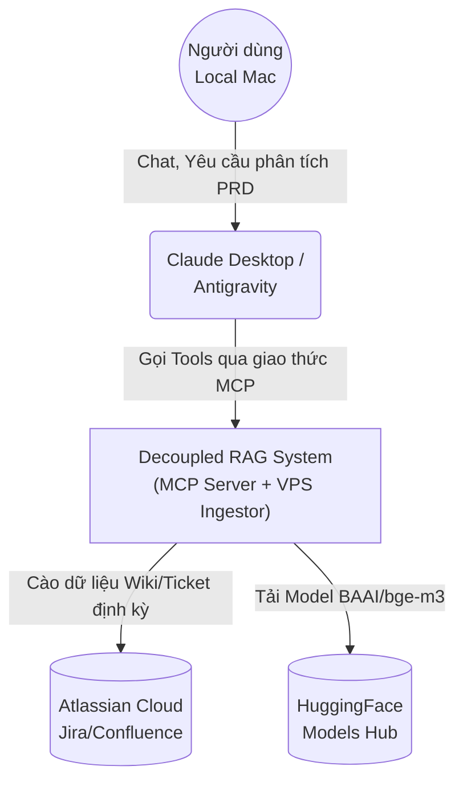
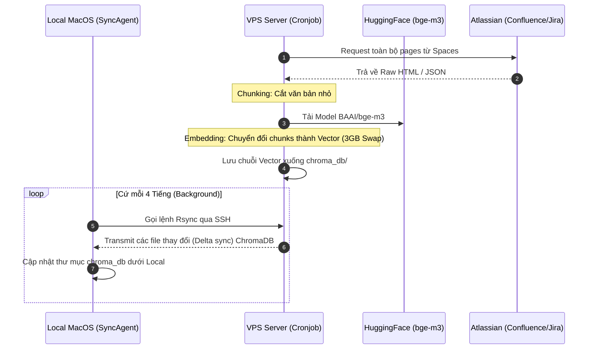
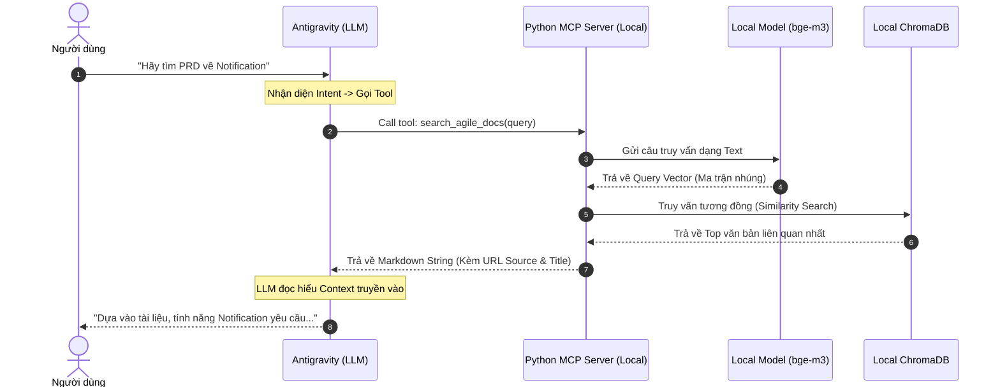

# Architecture Design: Decoupled RAG MCP Server

**Date:** 2026-03-31  
**Repository:** [MCP-server](https://github.com/cachep-xidau/MCP-server.git)  
**Target Audience:** Internal Developer Team (6-10 members), BSA, Tech Leads  
**Primary Goal:** Establish a unified Local MCP hub providing integrations with Figma, Jira, Confluence, and high-speed Offline Semantic RAG querying without relying on paid AI API keys.

---

## 1. System Overview

The **Decoupled RAG MCP Server** solves the Out-of-Memory (OOM) and latency challenges of running Heavy AI Models by splitting the pipeline into two environments:
1. **VPS Ingestor (Heavy Lifting):** Runs nightly via Cronjob. Scrapes Atlassian spaces, chunks data, and generates vectors using the open-source `BAAI/bge-m3` model via 3GB Swap processing. Outputs to ChromaDB.
2. **Local MCP Server (Zero-Latency Edge):** Runs on the team member's macOS. Quickly syncs the ChromaDB delta via `rsync` and resolves RAG queries instantly using local Mac CPU/RAM.

## 2. Architecture Topology (C4 Models)

### 2.1 Context Diagram


### 2.2 Container Diagram
```mermaid
graph TB
    subgraph "VPS Environment (Ubuntu Server)"
        Cron[Cronjob Scheduler\n(Linux)]
        Ingestor[Python Ingestor Script\nrag_pipeline.py]
        HF_Model_VPS[HuggingFace Model\nBAAI/bge-m3]
        DB_VPS[(ChromaDB\nVector Database)]
        
        Cron -->|Trigger 1:00 AM| Ingestor
        Ingestor -->|Init & Embed Text| HF_Model_VPS
        Ingestor -->|Save Vectors| DB_VPS
    end

    subgraph "Local Environment (macOS)"
        SyncAgent[macOS LaunchAgent\ncom.company.ragsync]
        DB_Local[(ChromaDB\nLocal Mirror)]
        MCP_Server[Python FastMCP Server\nserver.py]
        HF_Model_Local[HuggingFace Model\nBAAI/bge-m3]
        
        SyncAgent -->|Rsync Pull (mỗi 4h)| DB_VPS
        SyncAgent -->|Update| DB_Local
        MCP_Server -->|Read Vectors| DB_Local
        MCP_Server -->|Embed User Query| HF_Model_Local
    end

    Atlassian_Ext([Atlassian API]) -->|Fetch Data| Ingestor
    LLM_Client([LLM Client]) <-->|stdio / MCP Protocol| MCP_Server
```

## 3. Request Lifecycle Sequence Diagrams

### 3.1 Data Sync & Ingestion Flow (Nightly)


### 3.2 Real-time RAG Query Flow


## 4. Repository Structure & Installation

Mã nguồn hệ thống nay đã chuyển mình qua kiến trúc Python/ChromaDB:
- `vps-ingestor/rag_pipeline.py`: Cào dữ liệu chạy trên cronjob VPS Ubuntu.
- `local-rag-mcp/server.py`: FastMCP Server giao tiếp qua Stdio.
- `local-rag-mcp/sync.sh`: LaunchAgent rsync tự động.

### Cài đặt (Installation)
1. Kéo repository về: `git clone https://github.com/cachep-xidau/MCP-server.git`
2. Tạo Virtual Environment chuẩn: `python3 -m venv venv && source venv/bin/activate`
3. Cài đặt Data Science Core: `pip install -r requirements.txt` (HuggingFace, sentence-transformers, mcp, chromadb)

### Agent Configuration (Antigravity/Cursor)
Khai báo trực tiếp môi trường venv vào `mcp_config.json`:
```json
"jira-confluence-rag": {
  "command": "/Đường/dẫn/tới/MCP-server/local-rag-mcp/venv/bin/python",
  "args": ["/Đường/dẫn/tới/MCP-server/local-rag-mcp/server.py"]
}
```
