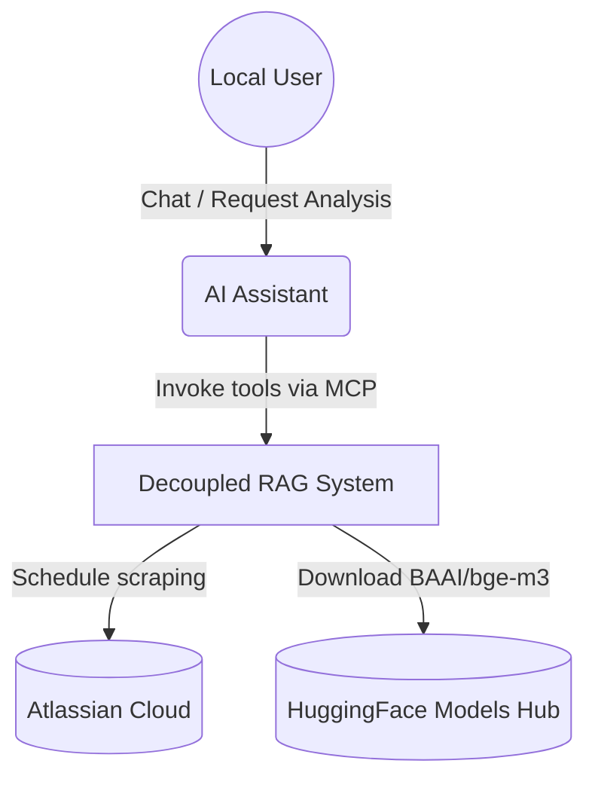
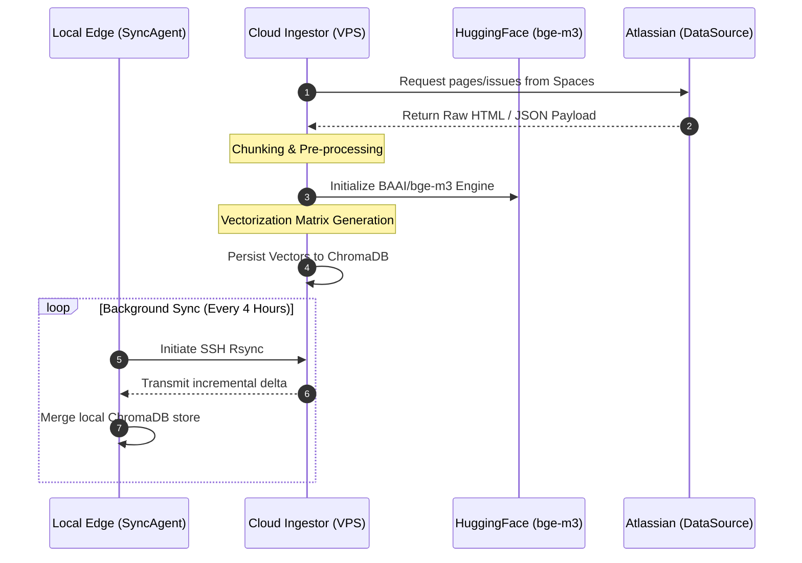
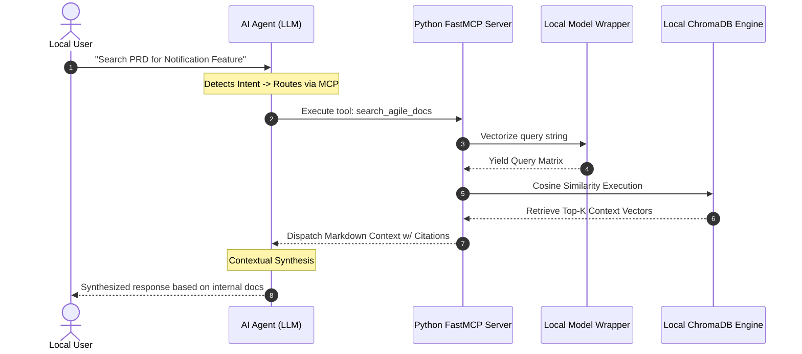
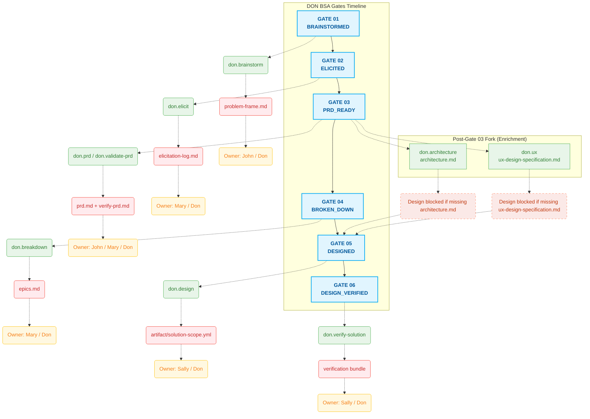

# Decoupled RAG MCP Server: Zero-Latency Semantic Search Architecture

**Date:** March 2026  
**Repository:** [MCP-server](https://github.com/cachep-xidau/MCP-server.git)

## 1. Executive Summary

A highly optimized Model Context Protocol (MCP) server providing zero-latency Semantic RAG querying and unified integration for Figma, Jira, and Confluence. The architecture completely decouples the heavy inference ingestion pipeline from the local execution edge, delivering lightning-fast, offline context retrieval without relying on expensive, cloud-based AI API keys. 

**Key Architectural Achievements:**
- Solved Out-of-Memory (OOM) and latency bottlenecks typically associated with heavy AI models.
- Designed a hybrid cloud-local topology utilizing a VPS for heavy lifting and local edge nodes for zero-latency execution.
- Established a robust Zero-Trust security network pipeline.

## 2. Architecture & Topology

The system is strategically split into two specialized environments:
1. **VPS Ingestor (Heavy Lifting):** A nightly cronjob pipeline that scrapes Atlassian data (Jira/Confluence spaces), segments the text, and produces vector embeddings using the open-source `BAAI/bge-m3` model via 3GB Swap processing. Output is stored in a centralized ChromaDB.
2. **Local Edge Server (Zero-Latency):** A local macOS-based FastMCP server that fetches differential ChromaDB updates via `rsync`. It processes RAG queries instantly using local compute resources.

### 2.1 Context Diagram


### 2.2 Container Diagram


## 3. Data Flow & Request Lifecycle

### 3.1 Nightly Data Sync & Ingestion Pipeline


### 3.2 Real-Time Edge RAG Query


## 4. Technical Stack, Modularity & Security

The system is built on a modern AI stack and is organized to cleanly delineate heavy cloud ingestion mechanisms from the local execution service, with security engineered at every layer.

### 4.1 System Modularity
- **`vps-ingestor/rag_pipeline.py` (Heavy-Lifting):** Handles scheduled data extraction and computationally intensive vectorization on the VPS.
- **`local-rag-mcp/server.py` (Local Execution):** Low-footprint FastMCP listener and similarity execution block on the macOS edge.
- **`local-rag-mcp/sync.sh` (Automation):** LaunchAgent executable automating differential replication without user intervention.

#### Configuration Injection
```json
"jira-confluence-rag": {
  "command": "/path/to/MCP-server/local-rag-mcp/venv/bin/python",
  "args": ["/path/to/MCP-server/local-rag-mcp/server.py"]
}
```

### 4.2 Technical Stack
- **Core & AI:** Python 3.x, FastMCP Protocol, HuggingFace (`sentence-transformers`, `BAAI/bge-m3`), ChromaDB.
- **Infrastructure:** Ubuntu Server, macOS, Unix Cron, macOS LaunchAgents.
- **Security & Networking:** Tailscale (VPN), Rsync over SSH, UFW (Uncomplicated Firewall).

### 4.3 Zero-Trust Security Posture
System-wide security prevents unauthorized access and protects sensitive enterprise data during transport:
- **Tailscale Mesh VPN:** Traffic operates exclusively within a private, encrypted overlay network between the VPS and edge node.
- **Strict UFW Firewall:** Public SSH (port 22) and external vectors are blocked; synchronization relies solely on the safe `tailscale0` interface.
- **Certificate-Based Automation:** Password authentication is completely disabled on the VPS. Unattended `sync-db.sh` processes use hardened `id_ed25519` keys.

---
*Developed as a technical showcase for advanced AI orchestration, context engineering, and decoupled system design.*

## 5. AI Coworker (DON BSA Gates Timeline)


