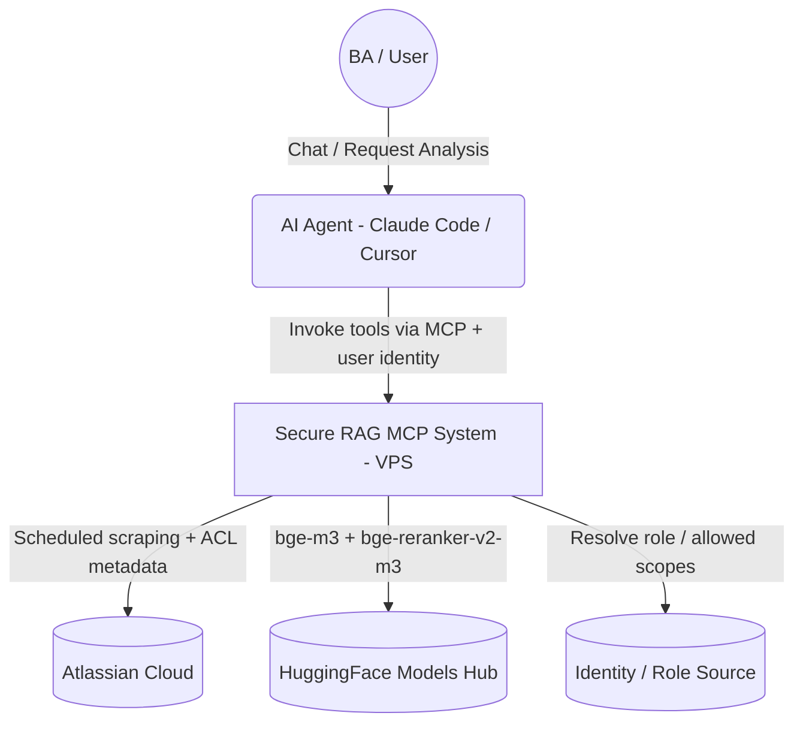
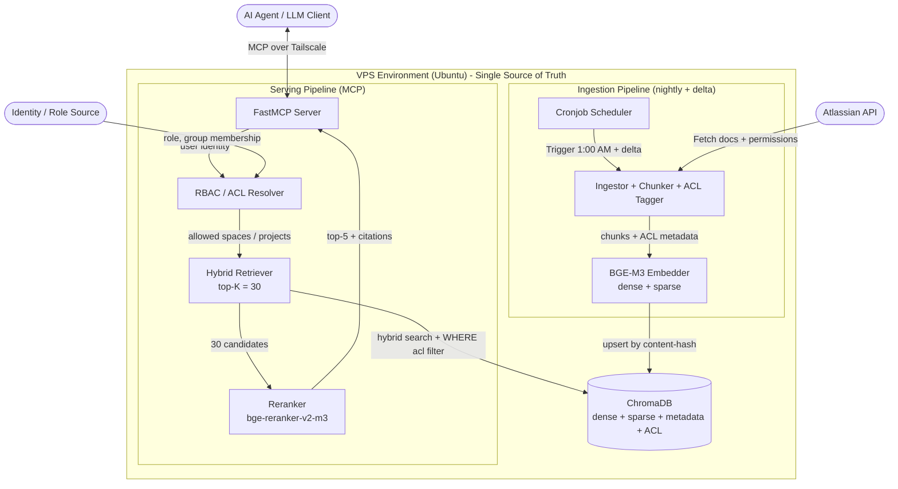
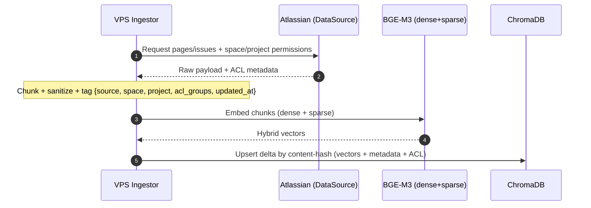
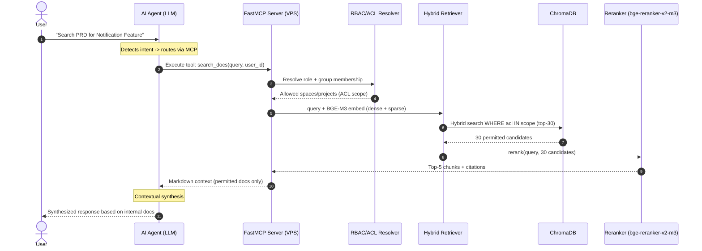
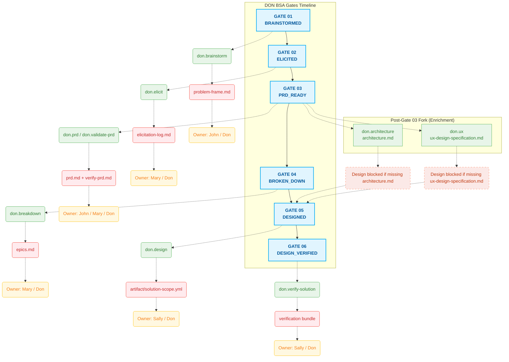

# Secure RAG MCP Server: Hybrid Retrieval + Reranking with RBAC/ACL

**Date:** March 2026 (updated July 2026)
**Repository:** [MCP-server](https://github.com/cachep-xidau/MCP-server.git)

## 1. Executive Summary

A Model Context Protocol (MCP) server providing governed Semantic RAG over Figma, Jira, and Confluence. A **single VPS** owns the full lifecycle — ingestion, indexing, and serving — behind one authoritative ChromaDB (single source of truth). Retrieval quality is driven by **hybrid search (dense + sparse) + cross-encoder reranking**, and every query is gated by **RBAC/ACL** so users only ever see documents they are permitted to see.

**Key Architectural Principles:**
- **Single source of truth:** one ChromaDB on the VPS. No local mirror, no `rsync` replica, no split-brain / staleness window (zero-latency edge topology intentionally dropped — see §2.3).
- **Quality-first retrieval:** hybrid recall → ACL pre-filter → cross-encoder rerank → top-5 (precision over raw cosine top-K).
- **Governed access:** RBAC (role → allowed data domains/tools) + ACL (per-document space/project permissions) enforced *before* similarity search.
- **Zero-Trust transport:** Tailscale mesh VPN + UFW + Ed25519 key-based automation.

## 2. Architecture & Topology

The system runs entirely on the **VPS**, split into two logical pipelines that share one ChromaDB:

1. **Ingestion Pipeline (nightly + delta):** a cron pipeline scrapes Atlassian (Jira/Confluence), chunks and sanitizes text, **captures source ACL metadata** (space keys, project roles, restriction labels), embeds with `BAAI/bge-m3` (dense + sparse), and upserts deltas keyed by content-hash.
2. **Serving Pipeline (MCP):** a FastMCP server resolves the caller's role/ACL scope, runs a hybrid retrieve constrained to permitted documents, reranks candidates with `BAAI/bge-reranker-v2-m3`, and returns the top-5 chunks with citations. AI clients connect over Tailscale via MCP.

### 2.1 Context Diagram


### 2.2 Container Diagram


### 2.2.1 Ingestion Pipeline (VPS)
Transforms raw Atlassian sources into a governed vector index.

- **Cronjob Scheduler:** triggers the ETL pipeline at `1:00 AM` daily (off-peak). Between full runs, delta re-indexing is keyed by **content-hash** so unchanged chunks are skipped.
- **Ingestor + Chunker + ACL Tagger:** pulls PRDs, Epics, and User Stories from Jira/Confluence; sanitizes and chunks; and tags each chunk with metadata `{source, space, project, acl_groups, restriction_labels, updated_at}`. **Source permissions travel with the document** — this is what makes downstream ACL filtering possible.
- **BGE-M3 Embedder:** encodes each chunk into **both dense and sparse (lexical) vectors** in a single pass. `bge-m3` natively supports dense + sparse retrieval, so hybrid search needs no second embedding model.
- **ChromaDB:** the single authoritative store, holding hybrid vectors + metadata + ACL fields.

### 2.2.2 Serving Pipeline (VPS, MCP)
Answers queries with precision and permission enforcement.

- **FastMCP Server:** the MCP interface. Tools (e.g. `search_docs`) receive the query **plus the caller's identity**.
- **RBAC / ACL Resolver:** resolves the caller's role → allowed data domains/tools (RBAC), and expands group membership → allowed spaces/projects (ACL). Produces a metadata scope filter.
- **Hybrid Retriever:** embeds the query with `bge-m3` (dense + sparse) and runs similarity search **constrained by the ACL `WHERE` filter** — restricted chunks never enter the candidate set (pre-filtering, not post-filtering). Returns top-K = 30 for recall.
- **Reranker (`bge-reranker-v2-m3`):** a cross-encoder that re-scores the 30 permitted candidates against the query and keeps the top-5. This is the primary precision lever versus raw cosine top-K.
- **AI Client:** Claude Code / Cursor / Claude Desktop hook the MCP tool over Tailscale. Enterprise data stays inside the private overlay network.

### 2.2.3 Core Benefits
- **Higher answer precision:** hybrid recall + cross-encoder rerank cut noise and irrelevant chunks well below plain vector top-K.
- **Least-privilege by construction:** ACL pre-filtering guarantees a user cannot retrieve — or leak into an LLM prompt — any document their Atlassian permissions would deny.
- **Operational simplicity:** one node, one database. No replication daemon, no sync lag, no dual-model footprint to keep consistent.

### 2.3 Design Note — Why the Edge Mirror Was Removed
The earlier design ran a local macOS ChromaDB mirror synced every 4 hours via `rsync` for "zero-latency" edge queries. It was dropped deliberately:
- **Split-brain / staleness:** up to 4h of drift between VPS and mirror.
- **Redundant work:** full-DB replication re-shipped unchanged data; dual `bge-m3` load on both nodes.
- **Fragility:** LaunchAgent + rsync-over-SSH added moving parts for a latency win that a Tailscale round-trip already makes negligible for a knowledge-base workload.

Zero-latency is explicitly **out of scope**; correctness, freshness, and access governance are prioritized instead.

## 3. Data Flow & Request Lifecycle

### 3.1 Nightly + Delta Ingestion Pipeline


### 3.2 Governed RAG Query (RBAC/ACL + Rerank)


## 4. Technical Stack, Modularity & Security

A single-node AI service with a clean split between the ingestion pipeline and the serving pipeline, secured at transport and access layers.

### 4.1 System Modularity
- **`vps-ingestor/rag_pipeline.py` (Ingestion):** scheduled extraction, ACL tagging, and dense+sparse vectorization.
- **`vps-rag-mcp/server.py` (Serving):** FastMCP listener wiring RBAC/ACL resolution → hybrid retrieve → rerank.
- **`vps-rag-mcp/rbac.py` (Access Control):** role → tool/domain mapping (RBAC) and group → space/project expansion (ACL); emits the ChromaDB metadata filter.
- **`vps-rag-mcp/retriever.py` (Retrieval):** hybrid dense+sparse search + `bge-reranker-v2-m3` cross-encoder reranking.

> Removed vs. previous design: `local-rag-mcp/sync.sh` (LaunchAgent replication) and the local ChromaDB mirror are no longer part of the system.

#### Configuration Injection
```json
"jira-confluence-rag": {
  "command": "/path/to/MCP-server/vps-rag-mcp/venv/bin/python",
  "args": ["/path/to/MCP-server/vps-rag-mcp/server.py"]
}
```

### 4.2 Technical Stack
- **Core & AI:** Python 3.x, FastMCP Protocol, HuggingFace (`sentence-transformers`), `BAAI/bge-m3` (dense+sparse embedding), `BAAI/bge-reranker-v2-m3` (cross-encoder rerank), ChromaDB.
- **Infrastructure:** Ubuntu Server, Unix Cron.
- **Access & Security:** RBAC/ACL scope filtering, Tailscale (VPN), UFW (firewall), SSH/Ed25519.

### 4.3 Security & Access Posture
- **RBAC (Role-Based Access Control):** a caller's role determines which tools and data domains are reachable (e.g. BA vs HR scope).
- **ACL (Access Control List):** each chunk carries its source Atlassian permissions; queries are **pre-filtered** to the caller's allowed spaces/projects before similarity search, so restricted content never reaches retrieval or the LLM prompt.
- **Tailscale Mesh VPN:** all traffic stays inside a private encrypted overlay; MCP clients reach the VPS over `tailscale0`.
- **Strict UFW Firewall:** public SSH (port 22) and external vectors blocked; access limited to the Tailscale interface.
- **Certificate-Based Automation:** password auth disabled on the VPS; unattended jobs use hardened `id_ed25519` keys.

---
*Developed as a technical showcase for advanced AI orchestration, context engineering, governed retrieval (RBAC/ACL), and quality-first RAG design.*

## 5. AI Coworker (DON BSA Gates Timeline)



## 6. Performance Evaluation: RAG + Workflow vs. Direct Search

The table below compares system performance when using ad-hoc direct searches (Direct Search / Single Skills) versus the integrated model combining semantic search with automated workflows (RAG + Workflow).

| Evaluation Criteria | Direct Search / Single Skills | RAG + Workflow (MCP-server) |
| :--- | :--- | :--- |
| **Task Completion Velocity & Context Precision** | Medium. Heavily reliant on exact keyword-matching. | **Very High.** Hybrid dense+sparse retrieval + cross-encoder rerank capture exact context. |
| **Fuzzy Queries & Precision** | Low. Prone to failure or returning irrelevant documents without exact keywords. | **High.** Understands semantic intent and maps abstract concepts to relevant Docs. |
| **Access Governance** | None. Users manually browse whatever they can open; easy to over-share. | **Enforced.** RBAC/ACL pre-filtering guarantees users only retrieve permitted documents. |
| **Automation Rate** | ~30% - 40% (Humans must manually filter, chain information, and switch skills continuously). | **~85% - 90%** (Context is auto-injected from Atlassian straight into the analysis pipeline). |
| **Development Time (Man-hours)** | Low (Uses out-of-the-box tools, no integration overhead). | **High** initially (Setup for VPS Ingestor, ChromaDB, RBAC/ACL, Tailscale). |
| **Labor Arbitrage** | Low - Medium (Only mitigates sporadic manual lookup tasks). | **Very High** (Replaces a large portion of the documentation and synthesis workload of Junior/Mid-level BAs). |
| **Error Rate in Execution** | High. Risk of missing documents or AI hallucinations due to broken context. | **Low.** Reranked top-5 chunks minimize noise and hallucination. |
| **Human-in-the-loop Frequency** | Continuous (Humans must continuously prompt and review step-by-step). | **Sparse.** Intervention primarily occurs at strategic approval "Gates" (Proof Reviews). |
| **Token Consumption** | High (Wastes tokens reloading redundant context or copy-pasting entire pages). | **Optimized** (Only retrieves and injects reranked top-5 chunks containing exactly what is needed). |

### 6.1 ROI Calculation Formula (Return on Investment)

The profitability of the MCP-server RAG architecture is evaluated using the following formula:

$$ROI = \frac{\sum(T \times C) + \Delta R - (D + O)}{\sum(D + O)}$$

**Where:**
- **T**: Time saved (in hours).
- **C**: Average labor cost ($/h).
- **$\Delta R$**: Additional revenue generated from faster processing speeds (e.g., smoother workflows leading to quicker releases).
- **D**: Development & Deployment costs of the MCP-server (Capital Expenditure).
- **O**: Operational costs such as Cloud VPS servers, LLM Tokens, etc. (Operational Expenditure).
