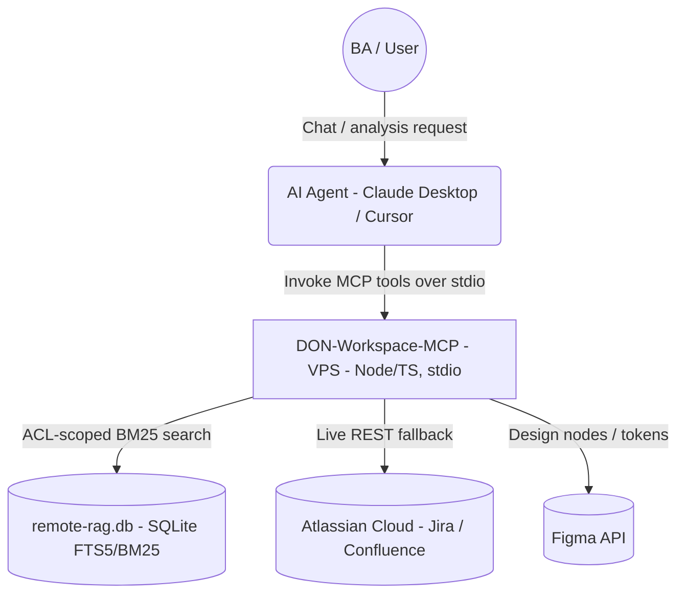
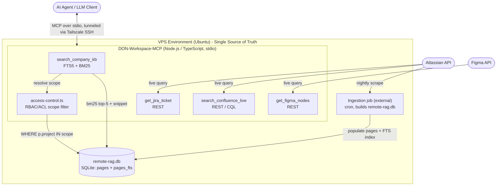
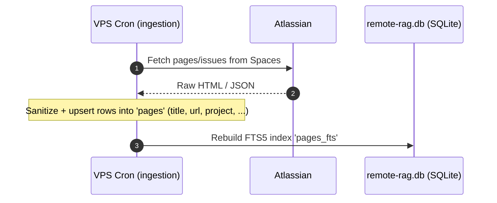
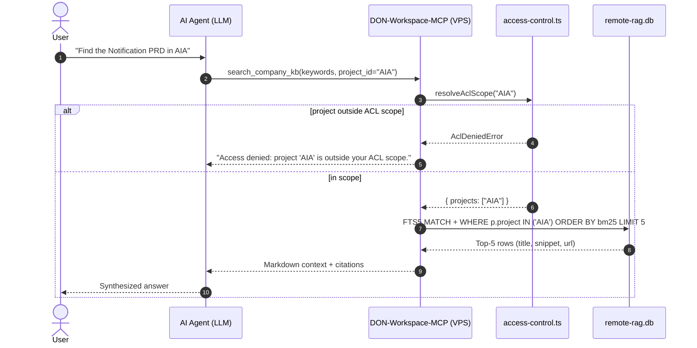
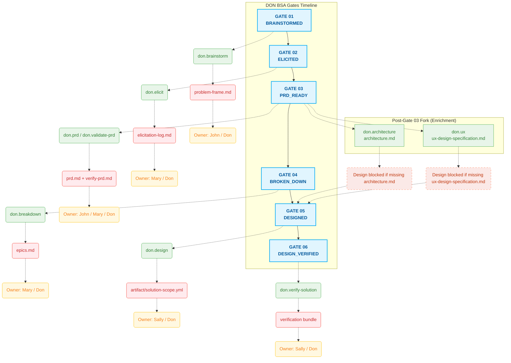

# DON Workspace MCP Server: BM25 Knowledge Base + Atlassian/Figma REST Hub

**Date:** March 2026 (updated July 2026)
**Repository:** [MCP-server](https://github.com/cachep-xidau/MCP-server.git)

## 1. Executive Summary

A Model Context Protocol (MCP) server (`DON-Workspace-MCP`) that gives an LLM assistant (Claude Desktop / Cursor / Antigravity) grounded access to internal company knowledge. It combines:

- an **offline keyword knowledge base** — SQLite **FTS5 + BM25** full-text search over a pre-built `remote-rag.db`, ACL-scoped per caller; and
- a **live REST hub** — on-demand tools that call Jira, Confluence, and Figma directly when the offline base is insufficient.

The server is a **single Node.js/TypeScript process** that runs on the **VPS** (single source of truth) and speaks MCP over stdio. There is no embedding model and no vector database in the current implementation — retrieval is lexical BM25. Semantic vector search is a documented future upgrade (§5).

**Key principles:**
- **Single source of truth:** one `remote-rag.db` on the VPS, read in place. No local mirror, no `rsync` replica, no staleness window.
- **Governed access:** RBAC/ACL pre-filtering restricts every KB query to the caller's permitted projects, in SQL, before results are returned.
- **Token-frugal:** `snippet()` returns short matched excerpts; `LIMIT 5` caps context injected into the LLM.
- **Zero-Trust transport:** Tailscale mesh VPN + UFW + Ed25519 keys.

## 2. Architecture & Topology

Everything runs on the **VPS**. A background ingestion job (external to this repo) periodically builds `remote-rag.db` from Atlassian; the MCP server reads that database and also exposes live REST tools.

### 2.1 Context Diagram


### 2.2 Container Diagram


### 2.2.1 MCP Tools
| Tool | Source | Purpose |
| :--- | :--- | :--- |
| `search_company_kb` | SQLite `remote-rag.db` | ACL-scoped FTS5/BM25 keyword search; returns top-5 `{title, snippet, url}`. |
| `get_jira_ticket` | Jira REST v3 | Fetch a ticket's summary/status/description by issue key. |
| `search_confluence_live` | Confluence REST (CQL) | Live page search when the offline base lacks results. |
| `get_figma_nodes` | Figma REST v1 | Fetch file components / nodes / design tokens (truncated to limit tokens). |

### 2.2.2 Knowledge-Base Retrieval (`search_company_kb`)
- **Store:** SQLite `remote-rag.db` with an FTS5 external-content table `pages_fts` over a base `pages` table (`id, title, url, project, ...`).
- **Ranking:** BM25 (`ORDER BY bm25(pages_fts)`), `LIMIT 5`. Query is an FTS5 string; the tool encourages OR-synonym expansion for recall (`"login OR sign-in OR oauth"`).
- **ACL pre-filter:** `resolveAclScope()` (in `src/security/access-control.ts`) turns the caller's env-provisioned scope into a `WHERE p.project IN (...)` clause. Out-of-scope `project_id` requests are denied; restricted rows never enter the result set. Requires a `project` column populated at ingestion.
- **Read-only:** the DB is opened `readonly`, lazily, so the server boots even if the DB is absent.

### 2.2.3 Access Control (RBAC / ACL)
Provisioned per deployment via environment variables (one host = one caller identity):
- `RBAC_ROLE` — caller role (e.g. `ba`, `hr`, `admin`); reserved for role-aware tool gating.
- `ACL_ALLOWED_PROJECTS` — comma-separated permitted project keys (e.g. `AIA,SUZ,AAV`). Unset = unrestricted (single-tenant/dev default; production should always set it).

### 2.2.4 Design Note — VPS-only (edge mirror removed)
An earlier design ran a local macOS ChromaDB/SQLite mirror synced every 4 hours via `rsync` (`scripts/sync-db.sh`) for "zero-latency" edge queries. It was removed:
- **Staleness/split-brain:** up to 4h drift between VPS and mirror.
- **Redundant work & fragility:** full-DB replication over cron+SSH for a latency win that a Tailscale round-trip already makes negligible for a KB workload.

The server now reads `remote-rag.db` in place on the VPS; clients connect by launching it over Tailscale SSH stdio (see §4 config).

## 3. Data Flow

### 3.1 Ingestion (external job builds the KB)

> The ingestion job that produces `remote-rag.db` is operated on the VPS and is **not part of this repository**; the MCP server only consumes the database.

### 3.2 Governed KB Query (RBAC/ACL + BM25)


## 4. Technical Stack, Modularity & Security

### 4.1 System Modularity
- **`src/index.ts`** — MCP server bootstrap; registers all tools; stdio transport.
- **`src/tools/search_kb.ts`** — FTS5/BM25 KB search with ACL pre-filter.
- **`src/security/access-control.ts`** — RBAC/ACL scope resolution and denial.
- **`src/tools/jira.ts` / `confluence.ts` / `figma.ts`** — live REST hub connectors.

> Removed vs. previous design: `scripts/sync-db.sh` and the local mirror.

#### Configuration Injection (VPS-only via Tailscale SSH)
```json
"don-workspace-rag": {
  "command": "ssh",
  "args": [
    "vps-tailscale-host",
    "DB_PATH=/opt/don-architecture/remote-rag.db",
    "ACL_ALLOWED_PROJECTS=AIA,SUZ,AAV",
    "RBAC_ROLE=ba",
    "node", "/opt/MCP-server/build/index.js"
  ]
}
```

#### Environment Variables
| Variable | Used by | Purpose |
| :--- | :--- | :--- |
| `DB_PATH` | search_company_kb | Path to `remote-rag.db` (default: CWD). |
| `RBAC_ROLE` | access-control | Caller role (informational / future gating). |
| `ACL_ALLOWED_PROJECTS` | access-control | Comma-separated permitted project keys. |
| `JIRA_HOST`, `JIRA_EMAIL`, `JIRA_API_TOKEN` | jira / confluence | Atlassian REST auth. |
| `API_KEY_FIGMA` | figma | Figma REST token. |

### 4.2 Technical Stack
- **Core:** Node.js, TypeScript, `@modelcontextprotocol/sdk` (stdio transport), `zod` (tool schemas), `dotenv`.
- **Knowledge base:** SQLite via `better-sqlite3`, FTS5 + BM25 ranking.
- **Infrastructure:** Ubuntu VPS, Unix Cron (external ingestion).
- **Access & Security:** RBAC/ACL SQL pre-filter, Tailscale (VPN), UFW (firewall), SSH/Ed25519.

### 4.3 Security & Access Posture
- **ACL pre-filter:** KB rows restricted to the caller's permitted projects in SQL, before results leave the server.
- **Read-only DB:** the KB is opened `readonly`; tools never mutate it.
- **Tailscale Mesh VPN + strict UFW:** access limited to the `tailscale0` interface; public SSH blocked.
- **Certificate-based automation:** password auth disabled on the VPS; hardened `id_ed25519` keys.

---
*Developed as a technical showcase for MCP tool design, governed retrieval (RBAC/ACL), and pragmatic BM25 knowledge grounding.*

## 5. Roadmap — Semantic Upgrade (Future)

The current retrieval is lexical BM25. A future upgrade adds a semantic layer without changing the MCP tool surface:
- **Embeddings:** `BAAI/bge-m3` (dense + sparse) at ingestion, stored alongside `pages`.
- **Hybrid retrieval:** combine BM25 with dense similarity for recall on paraphrased queries.
- **Reranking:** `BAAI/bge-reranker-v2-m3` cross-encoder to re-score candidates to a precise top-5.
- **Delivery:** likely a small Python/HTTP embedding+rerank sidecar the TypeScript MCP calls, keeping SQLite as the metadata/ACL store or migrating vectors to a dedicated store.

Until then, keyword expansion (OR-synonyms) is the recommended recall strategy for `search_company_kb`.

## 6. AI Coworker (DON BSA Gates Timeline)



## 7. Performance Evaluation: RAG + Workflow vs. Direct Search

Comparison of ad-hoc direct searches (Direct Search / Single Skills) versus this MCP server combining an ACL-scoped BM25 knowledge base with automated BA workflows.

| Evaluation Criteria | Direct Search / Single Skills | KB + Workflow (MCP-server) |
| :--- | :--- | :--- |
| **Context Precision** | Medium. Manual keyword lookups across tools. | **High.** FTS5/BM25 over curated docs + OR-synonym expansion; top-5 snippets. |
| **Fuzzy / Paraphrased Queries** | Low. Misses without exact keywords. | **Medium.** BM25 + synonym expansion helps; full semantic recall is a future upgrade (§5). |
| **Access Governance** | None. Users browse whatever they can open. | **Enforced.** RBAC/ACL pre-filtering restricts KB results to permitted projects. |
| **Automation Rate** | ~30% - 40% (manual filter/chain/switch). | **~85% - 90%** (context auto-injected into the analysis pipeline). |
| **Development Time** | Low (out-of-the-box tools). | **Medium** initially (MCP server, SQLite KB, RBAC/ACL, Tailscale). |
| **Error Rate** | High. Missing docs / broken context. | **Low.** Snippet + top-5 limit reduces noise injected into the LLM. |
| **Human-in-the-loop** | Continuous. | **Sparse.** Intervention at approval "Gates". |
| **Token Consumption** | High (reloads redundant context). | **Optimized** (`snippet()` + `LIMIT 5`). |

### 7.1 ROI Calculation Formula

$$ROI = \frac{\sum(T \times C) + \Delta R - (D + O)}{\sum(D + O)}$$

**Where:**
- **T**: Time saved (in hours).
- **C**: Average labor cost ($/h).
- **$\Delta R$**: Additional revenue from faster processing.
- **D**: Development & Deployment costs (CapEx).
- **O**: Operational costs — VPS, LLM tokens, etc. (OpEx).
