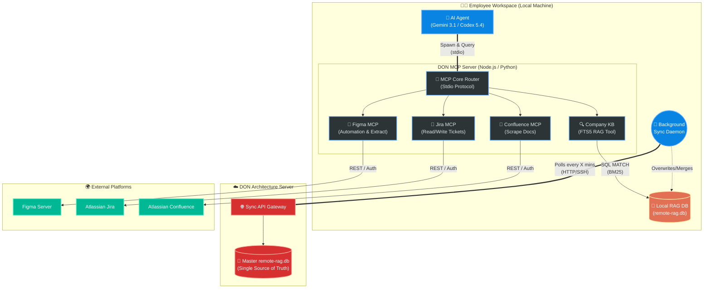

# Architecture Design: DON Workspace MCP Server

**Date:** 2026-03-23
**Repository:** [MCP-server](https://github.com/cachep-xidau/MCP-server.git)
**Target Audience:** Internal Developer Team (6-10 members), BSA, Tech Leads
**Primary Goal:** Establish a unified Local MCP hub providing integrations with Figma, Jira, Confluence, and high-speed Offline RAG querying.

---

## 1. System Overview

The **DON Workspace MCP Server** operates entirely on the "Local-First" methodology (Zero-Latency, YAGNI, KISS). Instead of establishing a vulnerable and latency-heavy remote server for AI Tool queries, the MCP Server is deployed locally on every team member's workspace (Laptop/PC) using the **`stdio` communication protocol**.

When an AI Agent (Gemini in Antigravity, local Codex CLI, etc.) requires context or external actions, it spawns this MCP Server locally.

## 2. Architecture Topology

The diagram below illustrates the complete execution environment, the background synchronization mechanism for the Knowledge Base, and the external API connections.

---

## 3. Core Components Breakdown

### 3.1. Local AI Agent & Stdio Protocol
The AI Agent initiates the standard Model Context Protocol via standard input/output (`stdio`). 
- **Ram Usage:** Extremely lightweight. Booting the Node.js/Python MCP process temporarily consumes only ~50-120MB memory. Process dies gracefully when the AI session ends.
- **Latency:** Execution time is limited purely by local CPU processing power. Network latency for establishing a tool connection is exactly `0ms`.

### 3.2. RAG Tool (FTS5-BM25 SQLite)
The primary Search Tool used by the `DON MCP Server`.
- Performs **Query Expansion** and applies `trigram`/`porter` tokenizers alongside FTS5.
- Uses the `snippet()` function to retrieve small contextual paragraphs rather than whole documents.
- Retrieves text exclusively from the local `remote-rag.db` replica, ensuring massive queries will not spam the central server or incur delay.

### 3.3. Remote Data Sync (Background Daemon)
For 10 simultaneous projects with constant internal spec updates, forcing the MCP to pull standard queries across the network is anti-pattern.
- A small background job (Cron/Script) continuously pulls the authoritative `remote-rag.db` from the **DON Architecture Server** to the `~/Company` workspace.
- **SQLite Advantage:** Reading the DB file doesn't block background pulling/replacing if orchestrated via WAL mode (Write-Ahead Logging). 

### 3.4. Multi-Service Integrations
Aside from RAG queries, the server acts as an aggregation point (Facade Pattern) for specialized automation:
- **Jira MCP:** Create Epics, track story points, retrieve acceptance criteria.
- **Confluence MCP:** Provide dynamic scraping when the offline RAG database doesn't hold the latest 5-minute changes.
- **Figma MCP:** Fetch design token updates, verify screen layouts against Figma nodes.

---

## 4. Implementation Steps Roadmap
1. **Initialize Project:** `npm init -y` with `@modelcontextprotocol/sdk` inside the `MCP-server` repo.
2. **Build the Stdio Server:** Expose a basic `search_company` tool.
3. **Database Driver:** Install `better-sqlite3` locally; wire the query logic shown previously.
4. **Agent Config:** Modify `gemini.config` or `.claude/mcp.json` to point the `command` target to the compiled JavaScript/Python root file.
5. **Scale Services:** Sub-route Jira and Figma classes into the tool handler block.
