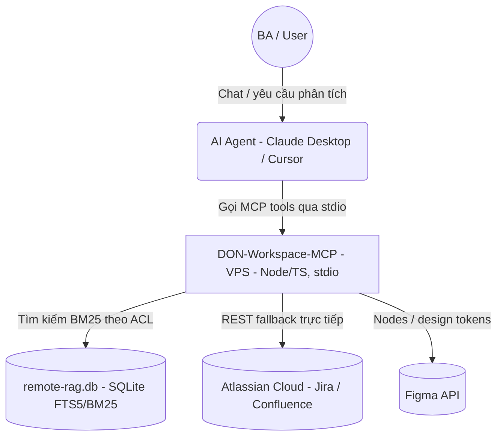
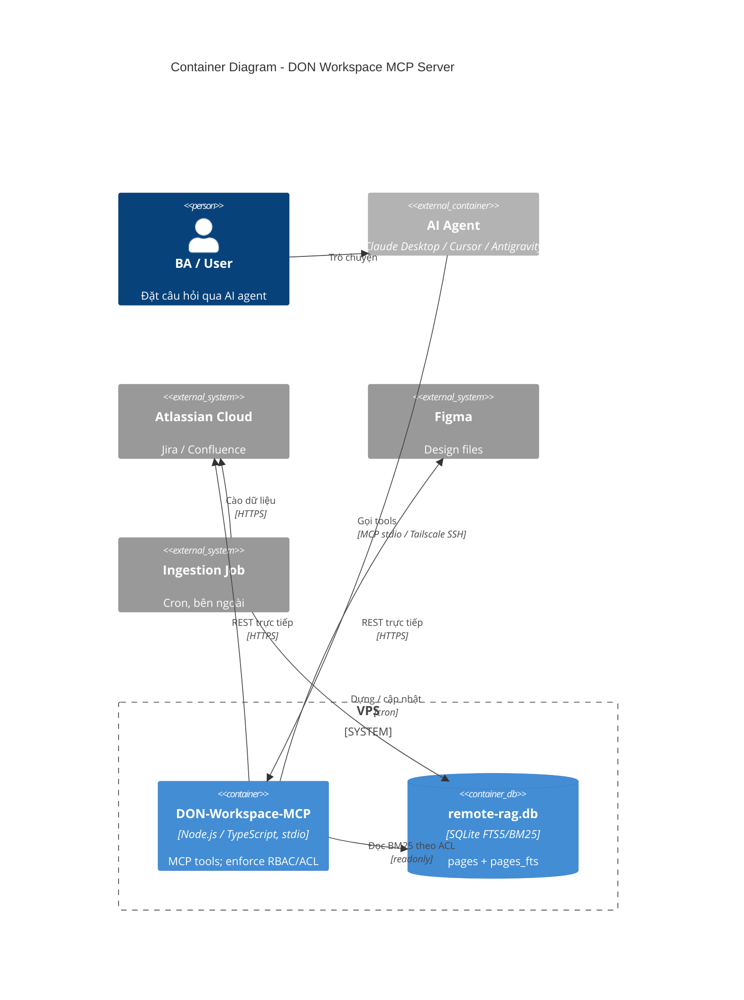
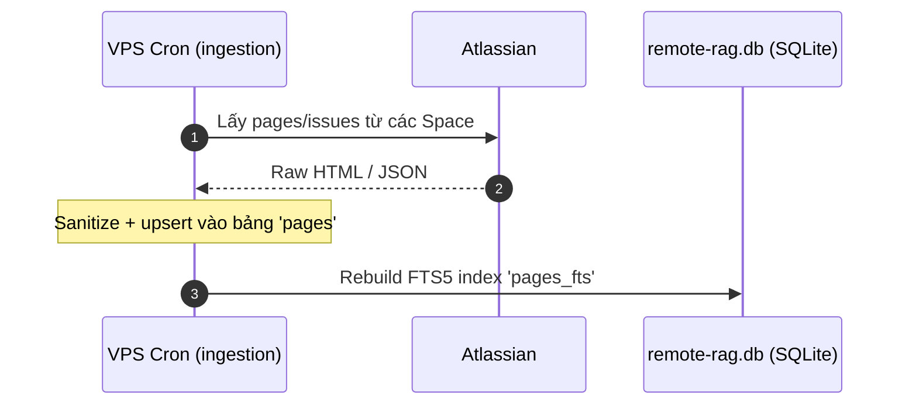
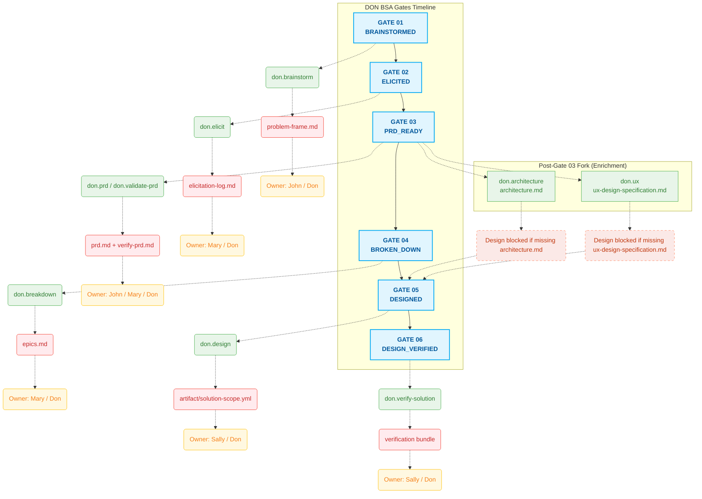

# DON Workspace MCP Server: BM25 Knowledge Base + Atlassian/Figma REST Hub

**Ngày:** March 2026 (cập nhật July 2026)
**Repository:** [MCP-server](https://github.com/cachep-xidau/MCP-server.git)

## 1. Executive Summary

Một Model Context Protocol (MCP) server (`DON-Workspace-MCP`) giúp LLM assistant (Claude Desktop / Cursor / Antigravity) truy cập có kiểm soát vào kho kiến thức nội bộ của công ty. Hệ thống kết hợp:

- một **offline keyword knowledge base** — full-text search bằng SQLite **FTS5 + BM25** trên `remote-rag.db` dựng sẵn, giới hạn theo ACL cho từng caller; và
- một **live REST hub** — các tool gọi trực tiếp Jira, Confluence, Figma khi kho offline không đủ.

Server là **một process Node.js/TypeScript** chạy trên **VPS** (single source of truth), giao tiếp MCP qua stdio. Bản hiện tại **không** dùng embedding model hay vector database — retrieval là lexical BM25. Semantic vector search là hướng nâng cấp tương lai.

**Nguyên tắc cốt lõi:**
- **Single source of truth:** một `remote-rag.db` duy nhất trên VPS, đọc tại chỗ. Không local mirror, không `rsync` replica, không có độ trễ dữ liệu (staleness).
- **Governed access:** RBAC/ACL pre-filter giới hạn mọi KB query về đúng các project mà caller được phép, ngay trong SQL, trước khi trả kết quả.

## 2. Architecture & Topology

Mọi thứ chạy trên **VPS**. Một ingestion job chạy nền (nằm ngoài repo này) định kỳ dựng `remote-rag.db` từ Atlassian; MCP server đọc database đó và mở thêm các live REST tool.

### 2.1 Context Diagram

### 2.2 Container Diagram

### 2.2.1 MCP Tools
| Tool | Nguồn | Chức năng |
| :--- | :--- | :--- |
| `search_company_kb` | SQLite `remote-rag.db` | Keyword search FTS5/BM25 theo ACL; trả top-5 `{title, snippet, url}`. |
| `get_jira_ticket` | Jira REST v3 | Lấy summary/status/description của ticket theo issue key. |
| `search_confluence_live` | Confluence REST (CQL) | Tìm page trực tiếp khi kho offline thiếu kết quả. |
| `get_figma_nodes` | Figma REST v1 | Lấy file components / nodes / design tokens (cắt bớt để tiết kiệm token). |

### 2.2.2 Knowledge-Base Retrieval (`search_company_kb`)
- **Store:** SQLite `remote-rag.db`, FTS5 table `pages_fts` trên base table `pages` (`id, title, url, project, ...`), mở read-only.
- **Ranking:** BM25, top-5; mở rộng OR-synonym để tăng recall.
- **ACL pre-filter:** `resolveAclScope()` thêm `WHERE p.project IN (...)`; request ngoài scope bị từ chối.

### 2.2.3 Access Control (RBAC / ACL)
Cấu hình theo từng deployment qua env vars:
- `RBAC_ROLE` — role của caller (dành cho role-aware gating sau này).
- `ACL_ALLOWED_PROJECTS` — danh sách project key được phép; bỏ trống = không giới hạn.

### 2.2.4 Design Note — VPS-only
Edge mirror trước đây (`sync-db.sh` rsync mỗi 4h) đã gỡ bỏ — gây staleness tới 4h đổi lấy độ lợi latency không đáng kể. Server giờ đọc `remote-rag.db` tại chỗ; client kết nối qua Tailscale SSH stdio.

## 3. Data Flow

### 3.1 Ingestion

> Ingestion job vận hành trên VPS và **không thuộc repository này**.

### 3.2 Governed KB Query

## 4. AI Coworker (DON BSA Gates Timeline)

## 5. Đánh giá Hiệu năng: RAG + Workflow vs. Direct Search

So sánh giữa tìm kiếm trực tiếp thủ công (Direct Search / Single Skills) và MCP server này — kết hợp BM25 knowledge base (theo ACL) với các BA workflow tự động.

| Tiêu chí đánh giá | Direct Search / Single Skills | KB + Workflow (MCP-server) |
| :--- | :--- | :--- |
| **Context Precision** | Trung bình. Tra keyword thủ công qua nhiều tool. | **Cao.** FTS5/BM25 trên tài liệu đã curate + OR-synonym; top-5 snippet. |
| **Fuzzy / Paraphrased Queries** | Thấp. Trượt nếu không đúng keyword. | **Trung bình.** BM25 + synonym expansion hỗ trợ; semantic recall đầy đủ là nâng cấp tương lai. |
| **Access Governance** | Không có. User xem mọi thứ họ mở được. | **Có enforce.** RBAC/ACL pre-filter giới hạn kết quả KB về đúng project được phép. |
| **Automation Rate** | ~30% - 40% (phải lọc/nối/switch thủ công). | **~85% - 90%** (context tự động đưa vào analysis pipeline). |
| **Development Time** | Thấp (dùng tool có sẵn). | **Trung bình** ban đầu (MCP server, SQLite KB, RBAC/ACL, Tailscale). |
| **Error Rate** | Cao. Thiếu tài liệu / đứt context. | **Thấp.** Snippet + giới hạn top-5 giảm nhiễu đưa vào LLM. |
| **Human-in-the-loop** | Liên tục. | **Thưa.** Chỉ can thiệp ở các "Gate" duyệt. |
| **Token Consumption** | Cao (nạp lại context thừa). | **Tối ưu** (`snippet()` + `LIMIT 5`). |

### 5.1 Công thức tính ROI

$$ROI = \frac{\sum(T \times C) + \Delta R - (D + O)}{\sum(D + O)}$$

**Trong đó:**
- **T**: Thời gian tiết kiệm (giờ).
- **C**: Chi phí lao động trung bình ($/h).
- **$\Delta R$**: Doanh thu tăng thêm nhờ xử lý nhanh hơn.
- **D**: Chi phí Development & Deployment (CapEx).
- **O**: Chi phí vận hành — VPS, LLM tokens, v.v. (OpEx).
