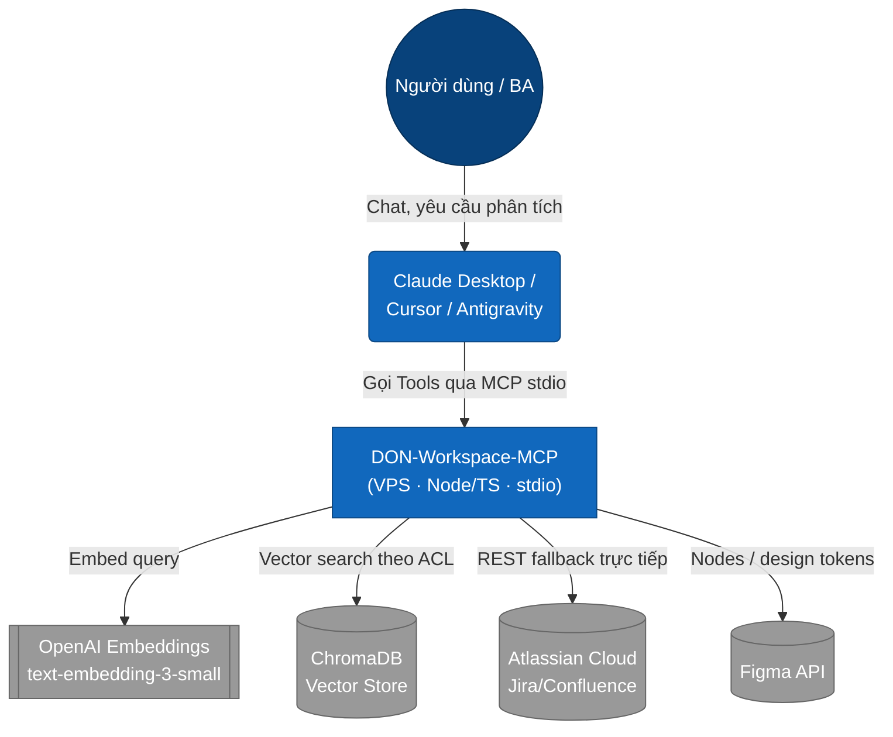
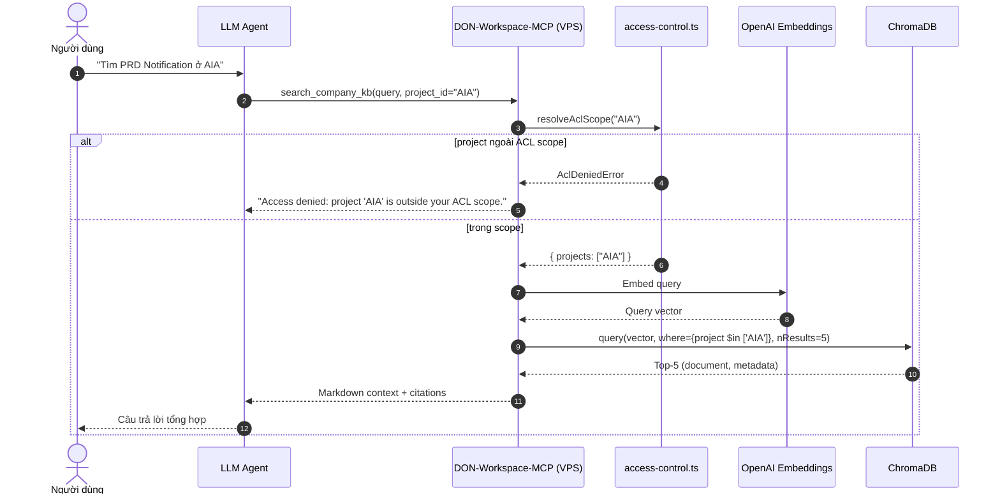

# System Architecture: DON Workspace MCP Server

Tài liệu mô tả kiến trúc, luồng dữ liệu và trình tự tương tác của **DON-Workspace-MCP** — một MCP server (Node.js/TypeScript) đưa tài liệu nội bộ Jira/Confluence và thiết kế Figma vào LLM Assistant (Claude Desktop/Cursor/Antigravity) qua giao thức Model Context Protocol (MCP).

> **Bản chất hệ thống:** **semantic search** — embedding bằng OpenAI `text-embedding-3-small` + vector search trên **ChromaDB** (ACL-scoped), cộng các tool REST gọi trực tiếp Jira/Confluence/Figma. Toàn bộ chạy trên **VPS** (single source of truth).

---

## 1. C4: System Context



---

## 2. C4: Container

Toàn bộ chạy trên **VPS**. Một ingestion job (ngoài repo này) định kỳ embed tài liệu và upsert vào ChromaDB; MCP server embed query và vector-search collection đó, đồng thời mở các tool REST live.

```mermaid
graph TB
    subgraph "VPS (Ubuntu) — Single Source of Truth"
        subgraph "DON-Workspace-MCP (Node.js/TS, stdio)"
            Search[search_company_kb\nvector search]
            ACL[access-control.ts\nRBAC/ACL scope]
            Jira[get_jira_ticket\nREST]
            Conf[search_confluence_live\nREST/CQL]
            Figma[get_figma_nodes\nREST]
        end
        Chroma[(ChromaDB\ncollection company_kb)]
        Ingest[Ingestion job (external)\ncron -> embed + upsert]

        Search -->|resolveAclScope| ACL
        ACL -->|where project in scope| Chroma
        Search -->|query vector, top-5| Chroma
        Ingest -->|upsert vectors + metadata| Chroma
    end

    OpenAI([OpenAI Embeddings\ntext-embedding-3-small])
    Search -->|embed query| OpenAI
    Ingest -->|embed docs| OpenAI

    Atlas([Atlassian API]) -->|scrape| Ingest
    Atlas -->|live query| Jira
    Atlas -->|live query| Conf
    FigmaExt([Figma API]) -->|live query| Figma
    LLM([LLM Client]) <-->|MCP stdio, tunneled qua Tailscale SSH| Search

    classDef container fill:#438dd5,color:#fff
    classDef db fill:#f2a74c,color:#fff
    class Search,ACL,Jira,Conf,Figma,Ingest container;
    class Chroma db;
```

---

## 3. Sequence: Ingestion (external job dựng KB)

```mermaid
sequenceDiagram
    autonumber
    participant Cron as VPS Cron (ingestion)
    participant Atlas as Atlassian (Confluence/Jira)
    participant OpenAI as OpenAI Embeddings
    participant Chroma as ChromaDB

    Cron->>Atlas: Fetch pages/issues từ Spaces (AIA, SUZ, AAV...)
    Atlas-->>Cron: Raw HTML / JSON
    Note over Cron: Sanitize + chunk; gắn metadata {project, title, url}
    Cron->>OpenAI: Embed chunks (text-embedding-3-small)
    OpenAI-->>Cron: Vectors
    Cron->>Chroma: Upsert vectors + metadata vào collection company_kb
```

> Job ingestion vận hành trên VPS và **không thuộc repo này**; MCP server chỉ tiêu thụ ChromaDB.

---

## 4. Sequence: Governed KB Query (RBAC/ACL + Vector Search)



---

## 5. Danh mục Công nghệ Cốt lõi

- **MCP Bridge:** `@modelcontextprotocol/sdk` (StdioServerTransport) — chuẩn hóa tools dưới dạng function calling cho Claude/Cursor.
- **Embeddings:** OpenAI `text-embedding-3-small` (qua `openai` SDK), dùng chung giữa ingestion và query.
- **Vector Store:** `ChromaDB` (JS client HTTP), collection `company_kb`, metadata `{project, title, url}`.
- **Access Control:** RBAC/ACL pre-filter bằng Chroma `where` (`src/security/access-control.ts`) — `RBAC_ROLE`, `ACL_ALLOWED_PROJECTS`.
- **REST Hub:** Jira REST v3, Confluence REST/CQL, Figma REST v1 (`fetch`, `zod` schema).
- **Infra & Security:** Node.js/TypeScript, Ubuntu VPS, Unix Cron (ingestion ngoài repo), Tailscale VPN, UFW, SSH/Ed25519.
