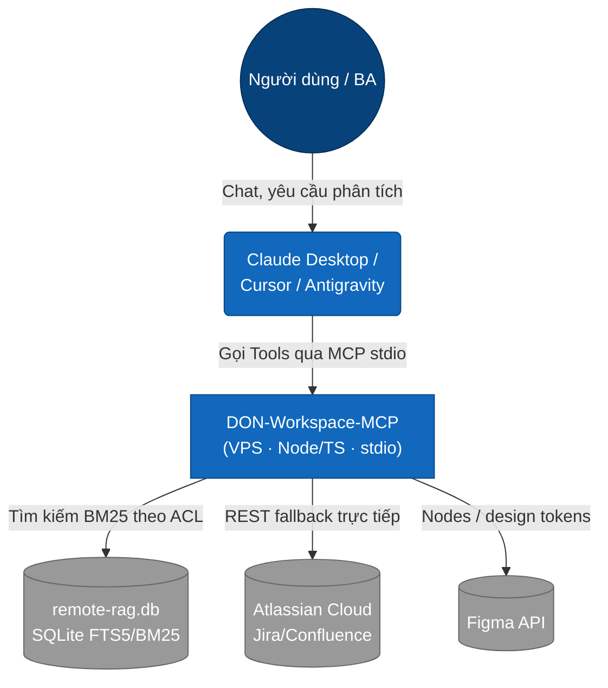
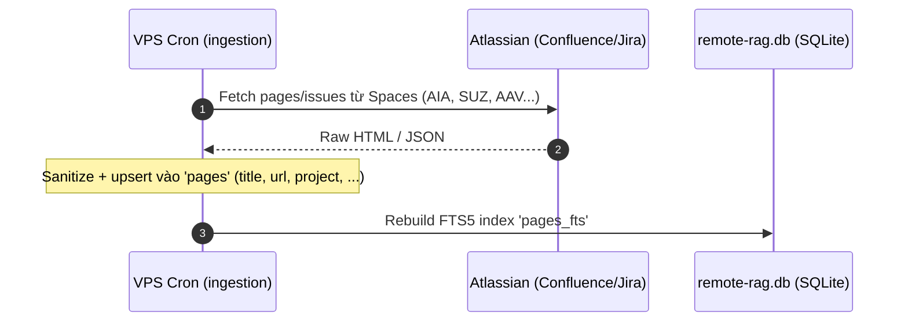
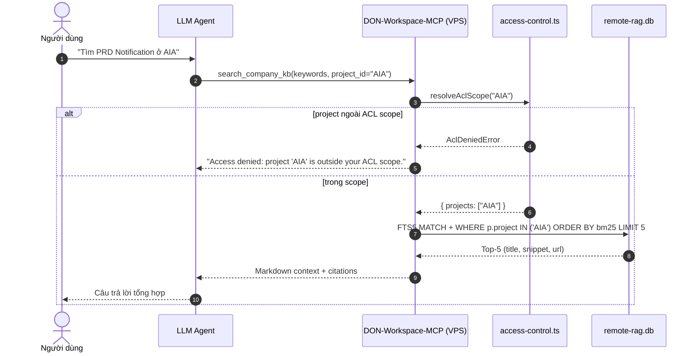

# System Architecture: DON Workspace MCP Server

Tài liệu mô tả kiến trúc, luồng dữ liệu và trình tự tương tác của **DON-Workspace-MCP** — một MCP server (Node.js/TypeScript) đưa tài liệu nội bộ Jira/Confluence và thiết kế Figma vào LLM Assistant (Claude Desktop/Cursor/Antigravity) qua giao thức Model Context Protocol (MCP).

> **Bản chất hệ thống:** tìm kiếm từ khóa **SQLite FTS5 + BM25** trên một `remote-rag.db` dựng sẵn (ACL-scoped), cộng các tool REST gọi trực tiếp Jira/Confluence/Figma. **Không** dùng vector/embedding trong bản hiện tại — semantic là nâng cấp tương lai (xem README §5). Toàn bộ chạy trên **VPS** (single source of truth).

---

## 1. C4: System Context



---

## 2. C4: Container

Toàn bộ chạy trên **VPS**. Một job ingestion (ngoài repo này) dựng định kỳ `remote-rag.db`; MCP server đọc DB đó và mở thêm các tool REST live.

```mermaid
graph TB
    subgraph "VPS (Ubuntu) — Single Source of Truth"
        subgraph "DON-Workspace-MCP (Node.js/TS, stdio)"
            Search[search_company_kb\nFTS5 + BM25]
            ACL[access-control.ts\nRBAC/ACL scope]
            Jira[get_jira_ticket\nREST]
            Conf[search_confluence_live\nREST/CQL]
            Figma[get_figma_nodes\nREST]
        end
        DB[(remote-rag.db\nSQLite: pages + pages_fts)]
        Ingest[Ingestion job (external)\ncron -> build DB]

        Search -->|resolveAclScope| ACL
        ACL -->|WHERE p.project IN scope| DB
        Search -->|bm25 top-5 + snippet| DB
        Ingest -->|populate pages + FTS index| DB
    end

    Atlas([Atlassian API]) -->|nightly scrape| Ingest
    Atlas -->|live query| Jira
    Atlas -->|live query| Conf
    FigmaExt([Figma API]) -->|live query| Figma
    LLM([LLM Client]) <-->|MCP stdio, tunneled qua Tailscale SSH| Search

    classDef container fill:#438dd5,color:#fff
    classDef db fill:#f2a74c,color:#fff
    class Search,ACL,Jira,Conf,Figma,Ingest container;
    class DB db;
```

---

## 3. Sequence: Ingestion (external job dựng KB)



> Job ingestion tạo `remote-rag.db` vận hành trên VPS và **không thuộc repo này**; MCP server chỉ tiêu thụ database.

---

## 4. Sequence: Governed KB Query (RBAC/ACL + BM25)



---

## 5. Danh mục Công nghệ Cốt lõi

- **MCP Bridge:** `@modelcontextprotocol/sdk` (StdioServerTransport) — chuẩn hóa tools dưới dạng function calling cho Claude/Cursor.
- **Knowledge Base:** `SQLite` qua `better-sqlite3`, index **FTS5** + xếp hạng **BM25** (`remote-rag.db`, mở readonly).
- **Access Control:** RBAC/ACL SQL pre-filter (`src/security/access-control.ts`) — `RBAC_ROLE`, `ACL_ALLOWED_PROJECTS`.
- **REST Hub:** Jira REST v3, Confluence REST/CQL, Figma REST v1 (`fetch`, `zod` schema).
- **Infra & Security:** Node.js/TypeScript, Ubuntu VPS, Unix Cron (ingestion ngoài repo), Tailscale VPN, UFW, SSH/Ed25519.
- **Tương lai (chưa triển khai):** embeddings `BAAI/bge-m3` (dense+sparse), hybrid retrieval, cross-encoder rerank `BAAI/bge-reranker-v2-m3` — xem README §5.
