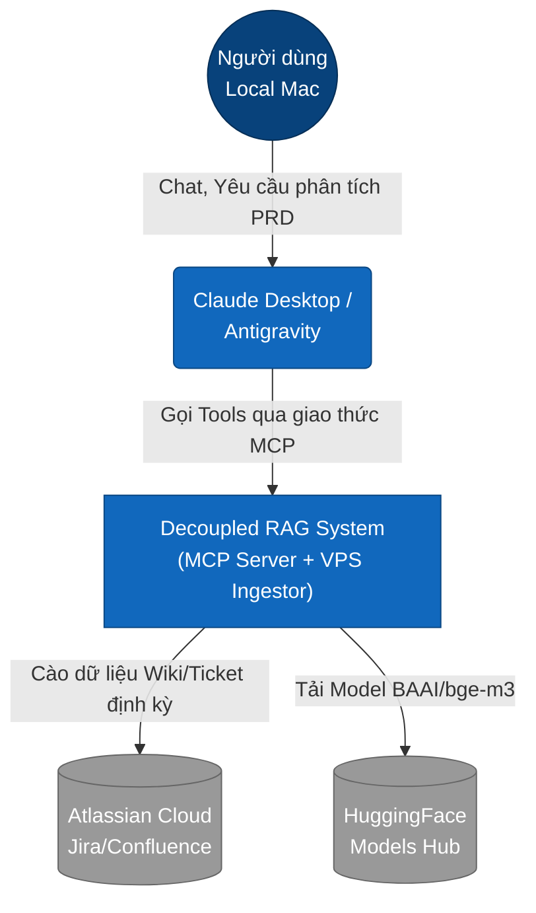
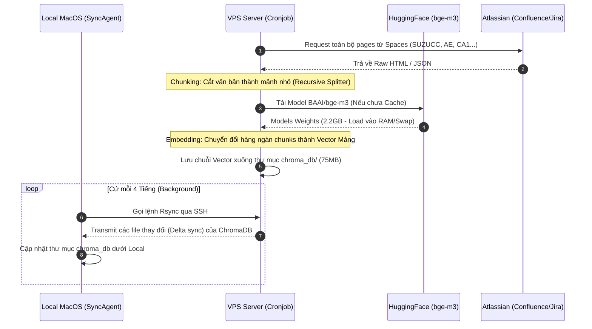
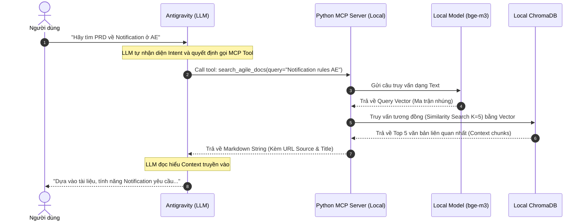

# System Architecture: Decoupled RAG MCP Server

Tài liệu này mô tả kiến trúc tổng thể, sơ đồ luồng dữ liệu (Data Flow) và trình tự tương tác (Sequence Diagram) của dự án **Decoupled RAG MCP Server** cho phép kết hợp tài liệu nội bộ Jira/Confluence vào trình LLM Assistant (Antigravity/Cursor) thông qua môi trường Model Context Protocol (MCP).

---

## 1. C4 Model: System Context Diagram
Mô tả bức tranh toàn cảnh về cách người dùng, hệ thống RAG và các dịch vụ bên ngoài kết nối với nhau.



---

## 2. C4 Model: Container Diagram
Cắt lớp hệ thống RAG (RAG_System) ra thành các Container chức năng cụ thể chạy trên 2 môi trường tách biệt: **Máy chủ từ xa (VPS)** và **Máy cá nhân (Local Mac)** để giải quyết bài toán hiệu năng (OOM) và độ trễ.

```mermaid
graph TB
    subgraph "VPS Environment (Ubuntu Server)"
        Cron[Cronjob Scheduler\n(Linux)]
        Ingestor[Python Ingestor Script\nrag_pipeline.py]
        HF_Model_VPS[HuggingFace Model\nBAAI/bge-m3]
        DB_VPS[(ChromaDB\nVector Database)]
        
        Cron -->|Trigger 1:00 AM| Ingestor
        Ingestor -->|Init & Embed Text| HF_Model_VPS
        Ingestor -->|Save Vectors| DB_VPS
    end

    subgraph "Local Environment (macOS)"
        SyncAgent[macOS LaunchAgent\ncom.company.ragsync]
        DB_Local[(ChromaDB\nLocal Mirror)]
        MCP_Server[Python FastMCP Server\nserver.py]
        HF_Model_Local[HuggingFace Model\nBAAI/bge-m3]
        
        SyncAgent -->|Rsync Pull (mỗi 4h)| DB_VPS
        SyncAgent -->|Update| DB_Local
        MCP_Server -->|Read Vectors| DB_Local
        MCP_Server -->|Embed User Query| HF_Model_Local
    end

    %% Giao tiếp giữa 2 hệ thống và bên ngoài
    Atlassian_Ext([Atlassian API]) -->|Fetch Data| Ingestor
    LLM_Client([LLM Client]) <-->|stdio / MCP Protocol| MCP_Server

    classDef container fill:#438dd5,color:#fff
    classDef db fill:#f2a74c,color:#fff
    
    class Ingestor,MCP_Server,SyncAgent,Cron container;
    class DB_VPS,DB_Local,HF_Model_VPS,HF_Model_Local db;
```

---

## 3. Sequence Diagram (Data Sync & Ingestion Flow)
Mô tả quy trình chạy nền (Background Process) diễn ra hàng đêm trên VPS nhằm cập nhật kho dữ liệu mà **không làm chậm máy tính của người dùng**.



---

## 4. Sequence Diagram (RAG Query Flow)
Luồng tương tác theo thời gian thực (Real-time) ngay khi người dùng trò chuyện với Trợ lý AI trên máy tính cá nhân.



---

## 5. Danh mục Công nghệ Cốt lõi
*   **Vector Engine**: `ChromaDB` (Mã nguồn mở, chạy Local, hỗ trợ Persist ra file DB vật lý).
*   **Embeddings Model**: `BAAI/bge-m3` (Top 1 Model Semantic Search đa ngôn ngữ của HuggingFace, ưu việt cho Tiếng Việt).
*   **Orchestration Framework**: `Langchain` (Quản lý Text Splitter, Document Loading, HuggingFace Integration).
*   **MCP Protocol Bridge**: `mcp.server.fastmcp` (Tạo StdIO Server chuẩn hóa để Claude/Antigravity tiếp nhận dưới dạng Function Calling).
*   **Infrastructure**: `Shell Script`, `Cron`, `macOS LaunchAgents`, `Linux Swap Optimization`.
